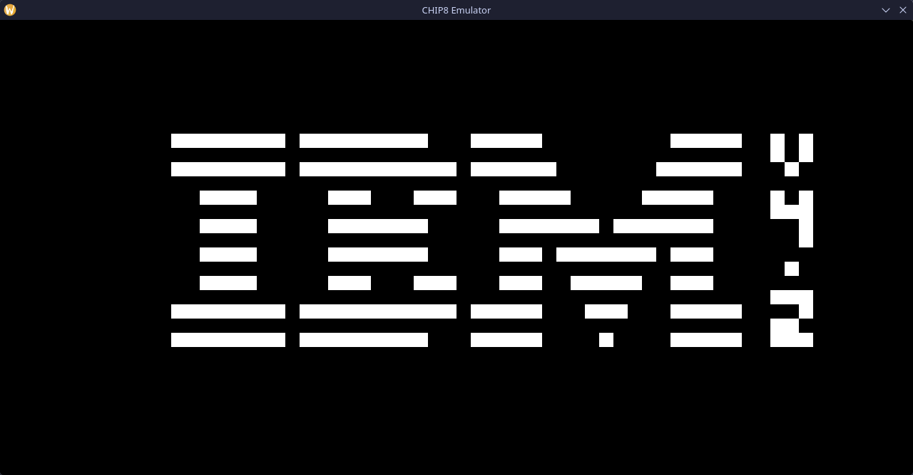
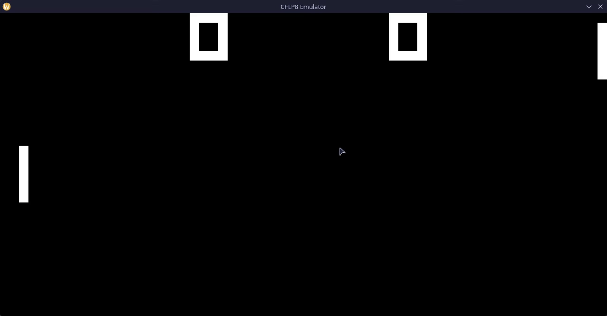

# CHIP8 Emulator made in modern C++

Fully functional CHIP8 emulator made using **C++23** and **SDL3**. All 35 opcodes are implemented and tested using multiple testing suites, like **Corax+** and **Flags** ROM.

I've leveraged many modern C++ features to make the emulator safer and more performant:

* `std::expected` for exception-free error handling
* `std::span` for read-only memory views
* `std::print` for type-safe, fmt-like printing
* `std::filesystem` for cross-platform handling of paths
* `std::optional` for modern nullable values

## Gallery

### IBM


### Pong


## Requirements

* C++23 compatible compiler
* CMake 3.28+
* SDL3 - optional, CMake will fetch it if not found on the host system

## Building

### Windows:
```bash
cmake -B build
cmake --build build --config Release
```

### Linux:
```bash
cmake -B build -DCMAKE_BUILD_TYPE=Release
cmake --build build
```

## Usage

```bash
./chip8-emulator <path> [ --ipf <instruction-count> ]
```

`--ipf` arguments controls how many instructions are executed per frame (at 60 Hz), for example - value of 10 means that emulator will execute 600 instructions per second.

ROM files can easily be found on GitHub, for example [kripod's repo](https://github.com/kripod/chip8-roms)

### Keyboard mappings

| CHIP8 | Keyboard |
| :--- | :--- |
| **1** | `1` |
| **2** | `2` |
| **3** | `3` |
| **C** | `4` |
| **4** | `Q` |
| **5** | `W` |
| **6** | `E` |
| **D** | `R` |
| **7** | `A` |
| **8** | `S` |
| **9** | `D` |
| **E** | `F` |
| **A** | `Z` |
| **0** | `X` |
| **B** | `C` |
| **F** | `V` |

## Resources
* [CHIP-8 Variant Opcode Table](https://chip8.gulrak.net/reference/opcodes/)
* [Guide to making a CHIP-8 emulator](https://tobiasvl.github.io/blog/write-a-chip-8-emulator/)
